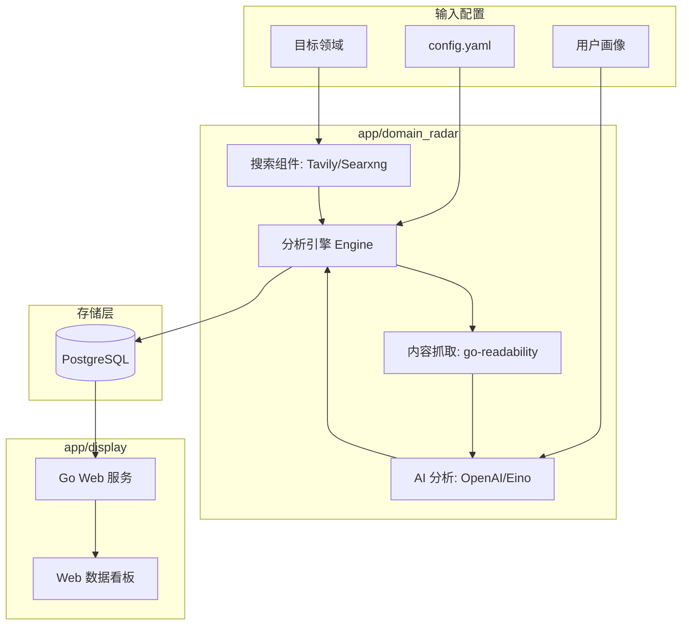

# DomainRadar (领域雷达)

DomainRadar 是一个智能化的领域情报分析工具。它利用先进的 LLM 技术和 Tavily/Searxng 搜索引擎，为您自动追踪、分析并总结特定领域的最新动态，生成深度洞察报告。

旨在帮助开发者、研究人员和行业关注者从海量信息中解放出来，快速掌握核心趋势。

## ✨ 核心特性

- **🎯 多领域精准监控**：支持自定义配置多个感兴趣的领域（如 AIGC, Web3, Cloud Native 等），针对性获取信息。
- **🔍 智能搜索增强**：集成 [Tavily](https://tavily.com/) 与 **Searxng** 双搜索引擎，自动过滤低质量内容，确保信息源的广度与深度。
- **📰 智能正文提取**：内置 `go-readability` 自动识别并提取网页核心内容，剥离广告与杂讯，为 AI 分析提供高质量素材。
- **🧠 深度 AI 分析 (Powered by CloudWeGo Eino)**：
  - **领域综述**：自动生成核心动态与热点话题总结。
  - **趋势洞察**：基于新闻分析未来的技术或市场走向。
  - **关键事件**：提取每日重要事件列表。
  - **热度评分**：量化领域活跃度，直观展现领域热度。
- **👤 个性化战略解读**：结合用户画像（User Persona），跨领域交叉分析，提供定制化的机遇挖掘、风险预警及行动建议。
- **📊 全方位报告展示**：提供完整的 Web UI 界面，支持历史报告检索、用户画像配置及 **多语言 (i18n)** 切换。
- **🛡️ 工业级工程设计**：内置并发控制与令牌桶限流机制，优雅处理 API 限制；采用模块化与接口化设计，易于扩展搜索源与存储后端。

## 🏗️ 项目架构



## 🛠️ 技术栈

- **语言**: Go (Golang) 1.25
- **搜索**: Tavily API, Searxng
- **LLM 框架**: [CloudWeGo Eino](https://github.com/cloudwego/eino)
- **Web 框架**: [Go Kratos](https://go-kratos.dev/) (用于展示服务)
- **ORM**: [Ent](https://entgo.io/) (实体框架)
- **数据库**: PostgreSQL
- **内容提取**: `go-readability`
- **依赖注入**: [Google Wire](https://github.com/google/wire)
- **前端**: HTML5, CSS3, JavaScript (原生 JS + i18n 支持)

## 🚀 快速开始

### 前置要求

- macOS / Linux / Windows
- Go 1.25
- PostgreSQL 数据库
- Tavily API Key ([获取地址](https://tavily.com/))
- LLM API Key (OpenAI 或其他兼容服务商)

### 1. 克隆项目

```bash
git clone https://github.com/iWorld-y/domain_radar.git
cd domain_radar
```

### 2. 配置项目

项目包含两个主要的配置文件：

1.  **核心引擎配置**：复制根目录下的 `config.yaml.example` 为 `config.yaml` 并填写相关 API Key 和数据库信息。
2.  **展示服务配置**：根据 [项目规则](.trae/rules/project_rules.md)，修改 `app/display/configs/config.yaml`。

```bash
# 复制示例配置文件
cp config.yaml.example config.yaml
cp app/display/configs/config.yaml.example app/display/configs/config.yaml
```

### 3. 构建与运行

使用 `Makefile` 提供的命令进行构建和运行：

```bash
# 1. 生成代码 (API & Wire)
make api
make wire

# 2. 编译展示服务
make build

# 3. 运行展示服务
# 该命令会自动读取 app/display/configs/config.yaml
make run
```

## 📂 项目结构

```text
.
├── app
│   ├── common          # 公共组件 (如 Ent 数据库模型)
│   ├── display         # 展示服务 (Web 看板)
│   └── domain_radar    # 核心分析引擎
├── docs                # 文档与 SQL 脚本
├── proto               # Protobuf 定义
├── Makefile            # 构建脚本
└── config.yaml.example # 核心引擎配置示例
```

## 🤝 开发指南

- **生成代码**: 修改 Proto 文件后运行 `make api`，修改依赖注入后运行 `make wire`。
- **静态检查**: 运行 `make lint` 进行代码检查。
- **运行测试**: 运行 `make test` 执行单元测试。
- **清理**: 运行 `make clean` 清理生成文件。

## 📄 开源协议

本项目采用 [MIT License](LICENSE) 开源协议。
